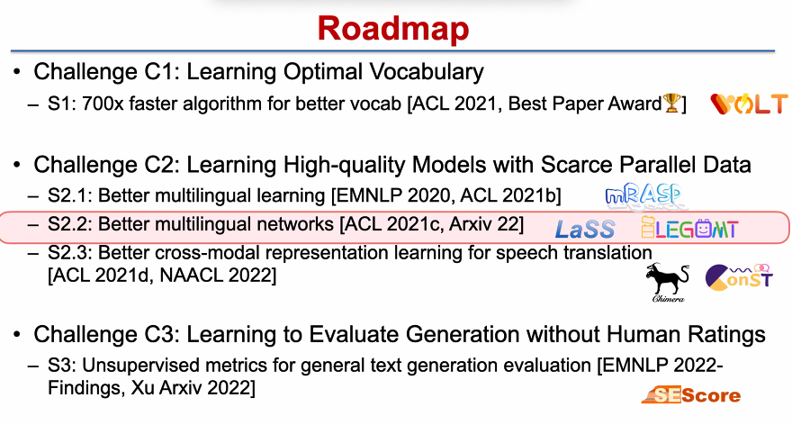
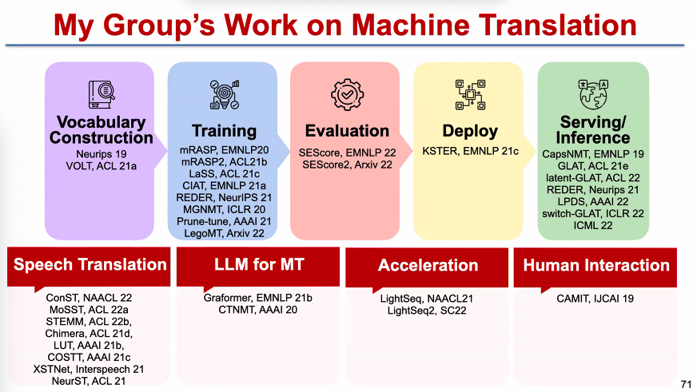
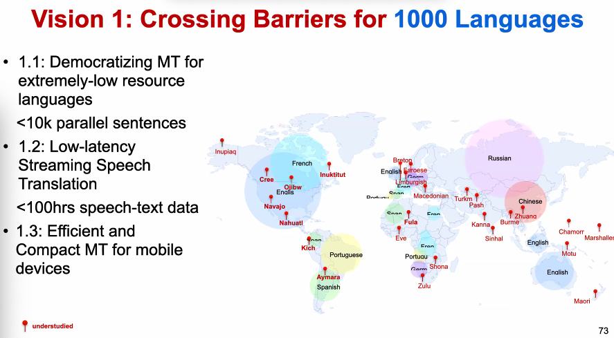
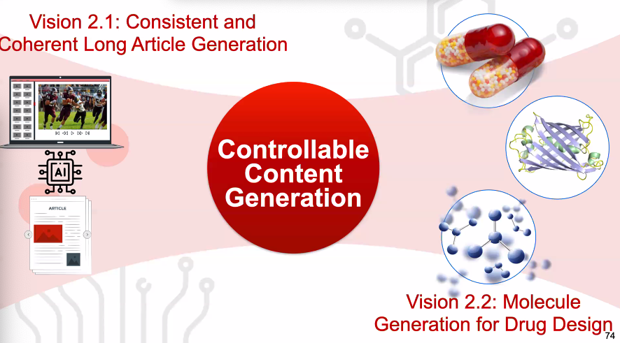

# Breaking Language Barriers with Massive Multilingual Machine Translation

Lei Li from UCSB

Machine Translation has increased international trade by 10%.

#### Challenge C1: Learning Optimal Vocabulary

1. S1 mainly introduces VOLT: Vocabulary Learning via Optimal Transport for Neural Machine Translation

   It changes the Machine Translation problem into (Best BLEU ==> Max MUV ==> Optimal Transport)

   Marginal Utility of information for Vocabulary (MUV) highly correlated with Machine Translation Performance

####Challenge C2: Learning High-quality Models with Scarce Parallel Data

1. S2.1 discussed mRASP to get better text representation using contrastive learning
2. S2.2 discussed LaSS and LEGOMT to push bilingual Machine Translation to hundreds of language Machine Translation
3. S2.3 discussed the broader line of translation, mainly focusing on speech-to-text translation
4. Moreover, Open-source Systems including  LightSeq are available 

#### Challenge C3: Learning to Evaluate Generation without Human Rating

For 1000 sentences, 2 weeks are required for human annotation.

SEScore1 and SEScore2 are proposed unsupervised evaluation metrics

#### Future Directions

Vision 1: Crossing Barriers for 1000 languages

Vision 2: Controllable Content Generation

Vision3: Towards Human-leval NL Reasoning

World Knowledge + Logic + Neural Representation

