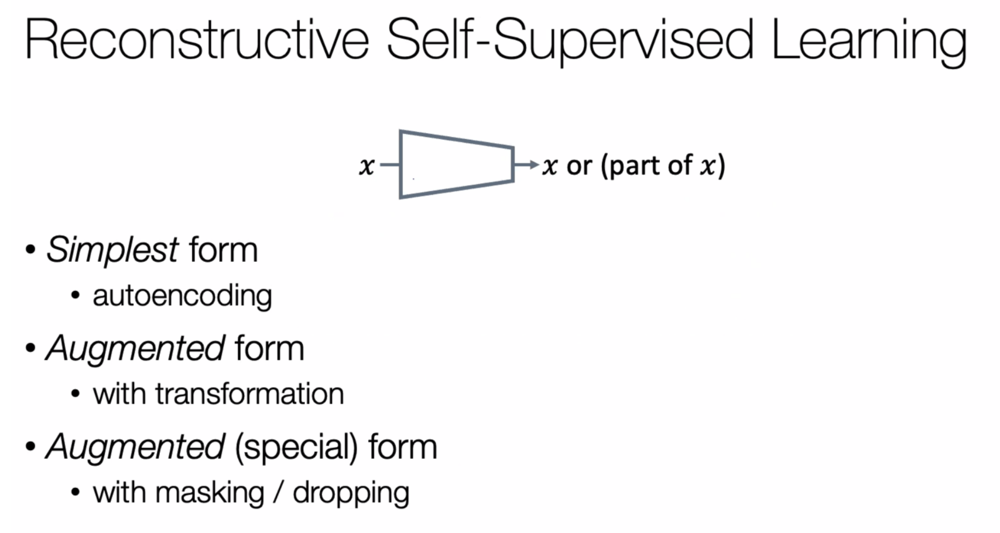
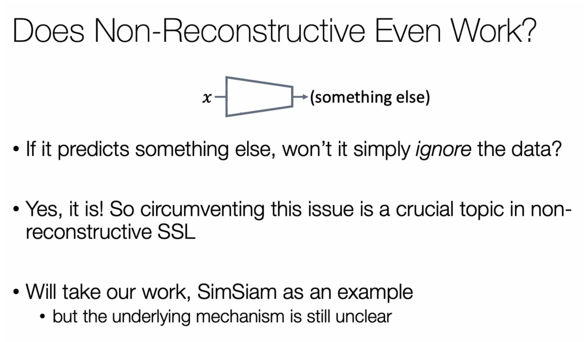
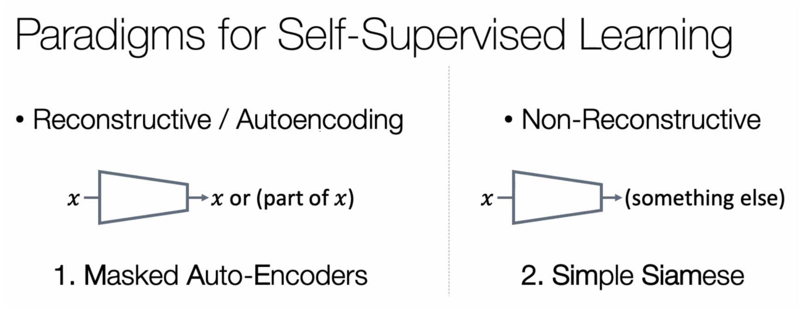

# Visual Representation Learning

Xinlei Chen from Meta

### Different forms of reconstructive self-supervised learning

For auto encoding: VAE

For augmented (special) form: BERT / GPT / VAE

Contrastive Learning is another form of reconstructive learning, but a weaker form.

### Does non-reconstructive even work?

Sim-Sam is a non-reconstrctive work.

## Overall Conclusion

