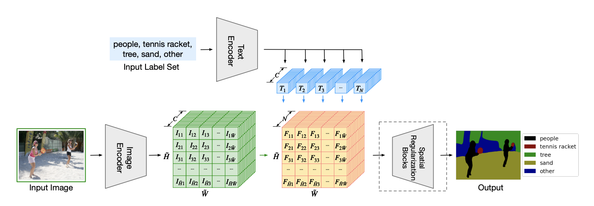

# Multimodel Modeling: Learning Beyond Visual Knowledge

by Boyi Li from Cornell

### Previous Semantic Segmentation Setup Disadvantages

1. fixed number classes
2. fixed order of classes
3. hard to transfer to another dataset
4. Limited to existing setups

### Language-driven semantic segmentation (ICLR 2022)

C dim for image encoder is no longer label number but feature number instead.

1. Language modeling can help enlarge label space, and LSeg is specially designed for **zero-shot settings** (segmentation label used for inference is unseen during training)

   LSeg can handle arbitrary label sets on the fly with varying length, content, and order

   1. unseen labels (dessert never appears in the training process, replace “plant” to be “greenery”)

   2. hierarchical labels (replace “cat” to be “furry”)

      

2. LSeg is tested under **few-shot** datasets and baselines due to a lack of a standardized protocol and sufficient datasets and baselines for the zero-shot setting and win the SoTA performance

3. LSeg with text encoder and image encoder is proved to incur only a negligible loss in performance when compared to the closest fixed-label segmentation method (which means text encoder does not bring too much harm to the whole architecture)

### Future Discussion

Open-world recognition is not just object-level

1. understand the relationship among objects
2. understand actions in videos
3. common sense reasoning