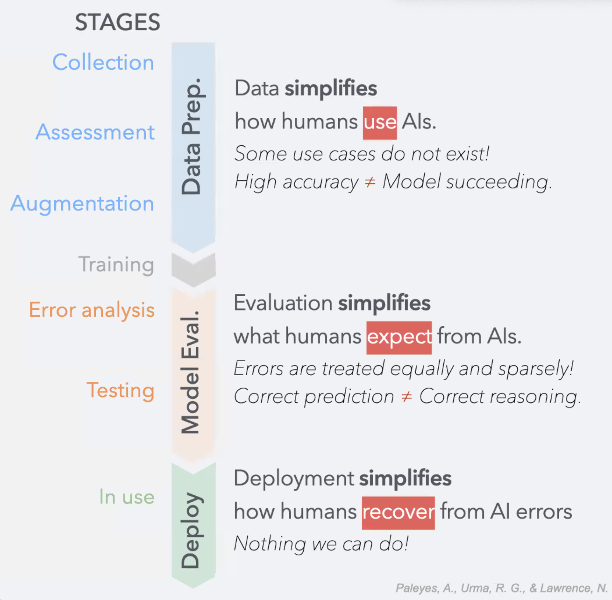
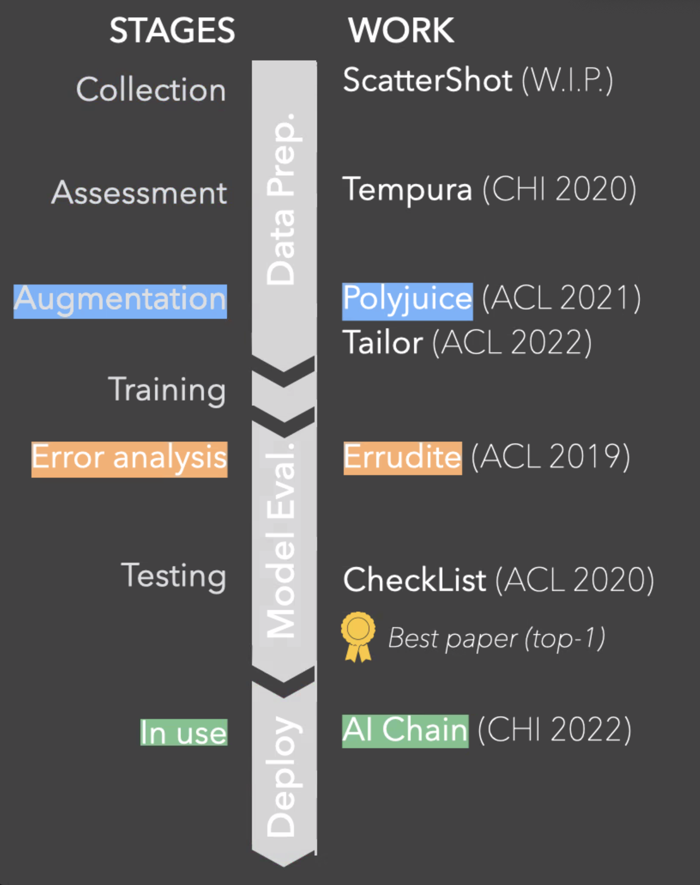
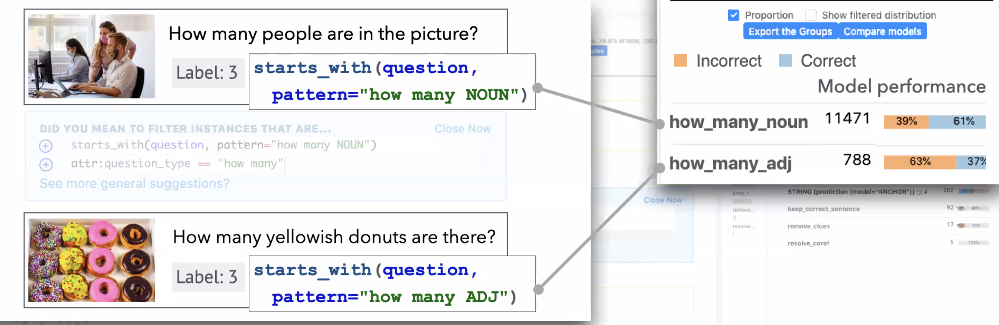
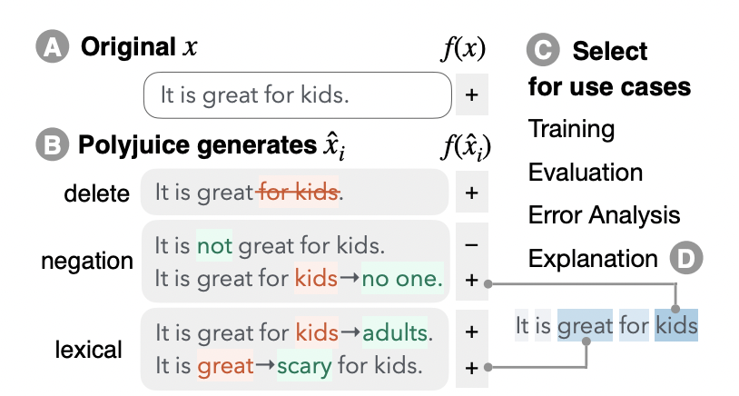

# Interactive AI Model: Debugging and Correction

by Sherry Tongshuang Wu from HCII and LTI

Fight AI errors by increasing model accuracy ---> But not enough

AI systems can **rely on wrong features**(correct prediction is not correct reasoning) or **miss certain types of data**(high accuracy is not the model succeeding).

### An overview of Sherry's research line:

Sherry actually contributes to stages except for the training stage. The HCI focuses are quite different from NLP, and they put much emphasis on the **User Study** (to gain feedback from human beings)

### Errudite (Error Analysis)

Model analysis reveals hidden deficiencies.

For example, in VQA, the model can not count objectives with adj. (yellowish donuts) 

*Errudite* system makes model analysis reproducible and comparable. This system includes two main parts: (quantitative grouping and counterfactual testing)

1. Quantitative grouping makes us inspect model features.

2. Counterfactual testing makes us figure out whether the model draws a correct conclusion based on wrong knowledge.

### Polyjuice (Augmentation)

Deal with counterfactuals phenomenon and do **counterfactuals data augmentation**.

The definition of counterfactuals:

1. Fluent in Language

	2.  Close to the origin, but have a different meaning
	2.  Have controllable attribute
	2.  Be diverse with a relationship with the origin

Counterfactuals Data Augmentation is useful to do:

1. Make up for the lack of human-labeled few counterfactuals.

2. Improve training and evaluation on different tasks
3. Augment SOTA explanation techniques

### AI Chain (Deploy for LLM)

This work lies at the deployment stage of LLM. It points out that we need to separate the whole task into different small tasks and make prompts for each of these tasks for a generation.

Do *split points* and *compose points* for LLM generation to improve the system transparency, controllability, and sense of collaboration.

### Ongoing: AIs inquiring and supporting humans

1. Query humans for clarification (e.g Human interactive via active learning)

2. Support human needs (e.g XAI for achieving human goals)

