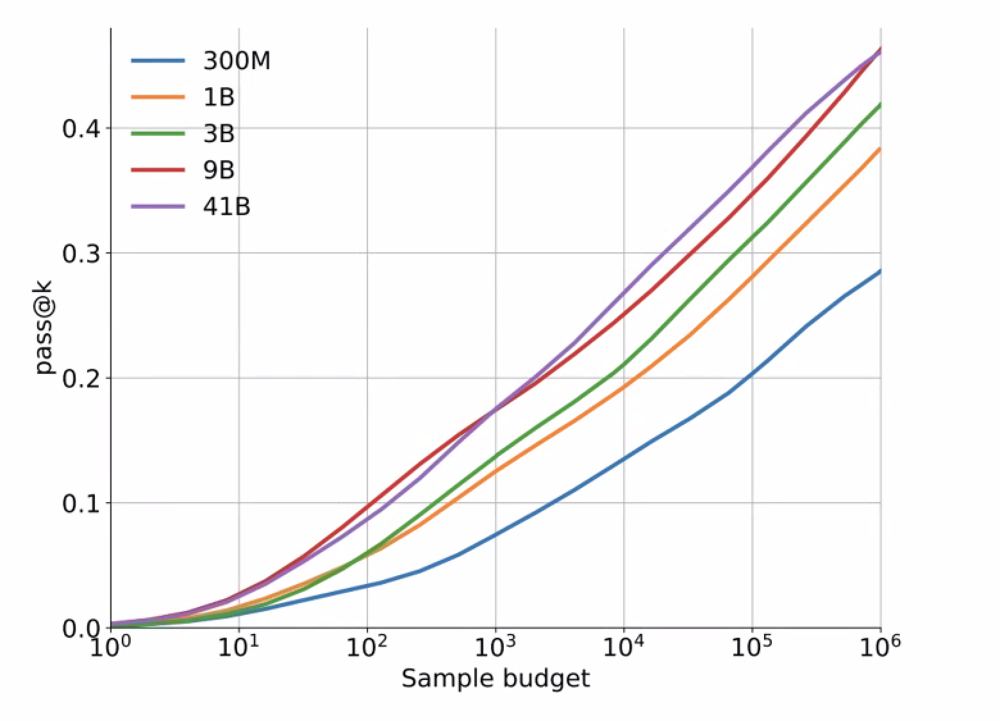

# The Future of Code Generation: Are bigger models the solution for AI-assisted programming?

LTI Topical Seminar

### Talk1: A big picture for Code Generation

By Caiming Xiong

### Talk2: Is model scaling all we need for program synthesis?

By Xinyun Chen

1.SPREADSHEETCODER: Formula Prediction from Semi-structured Context

Encode in two stages (encode column using the table structure) and decode in two stages (predict the sketch and the embedding)

For the row-based and column-based encoder, multiple rows and columns are concatenated to become the BERT input. In order to encode the context from more distant rows and columns, the rowwise and columnwise convolutional layers results are concatenated together $e=[c_r+c_c;e_b]$ to get the final token embedding for $e$.

For the decoder,  the decoder first generates the formula sketch, and then predicts the concrete ranges. It uses the shared same parameter of LSTM, but with different output layers.

2.AlphaCode Project

This model is evaluated on Codeforces.

When the model size increased dramatically, the performance for 9B and 41B does not increase a lot. Simply scaling cannot solve the Code Generation problem quite well. But scaling has significant increase when changing from 300M to 9B.

The overall pipeline for AlphaCode is as below. Sampling from transformer models can be easily parallelized, which allowed us to scale to millions of samples per problem – a critical driving force for performance improvement. The key part of AlphaCode is **SAMPLING & EVALUATION**.

STAGE1: Use different tags and decoding methods to do large-scale sampling. 

STAGE2: Run the code on example test case and filter all possible codes that cannot pass. 

After that, we find solutions by filtering and remove 99% of the model samples. Filtering using example test can still have thousands of candidate programs per problem.

STAGE3: Execute all remaining programs to cluster all programs that have the same output.

Clustering is introduced to try to reduce the testing trial time.  We could then avoid repeatedly picking from the same clusters and got the same output. The clustering process is based on  a seperately trained test input generation model, using the same architectures as our main model.This model was trained to predict test inputs from problem descriptions, using example, hidden, and generated test inputs as training data. After training, this model was used to create new test inputs for unseen problems. 

Looking forward: Challenges of Language Models for Code

1. Modeling hierarchical structures
   1. Long-range context
   2. Generation of Long program
2. Sample Efficiency
   1. Generate correct and complicated programs within a few samples
   2. Model Calibration, sample reranking
3. Going from (short) instruction following to algorithmic reasoning

### Talk3: Learning on Code:Bugfinding

by Marc Brockschmidt

LLM4Code Challenges

1. Intent Specification

   * How do users tell the model what they want?
   * Can you express complex specs more concisely than in code?

2. Data Quality

   * Most code on the internet is not ... perfect?

   * Relatively little data matching specs to code

3. Context 

   * software engineering is more than a single file: libraries, bugs, reviews, etc

4. UX

   * How to be helpful without being intrusive

1.BugLab: Self-Supervised Bug Detection and Repair

Core Idea: Generate Bugs and detect them

Use a self-supervised way to generate and correct bugs.

STEP1 Use fixed set of mutation rules like text rewrites / variable swap / argument swap to generate bugs.

STEP2 Select different bugs from generated codes using selector

STEP3 Detect different bugs from possible bugs using detector

**Talk4: NLP Grounding**

