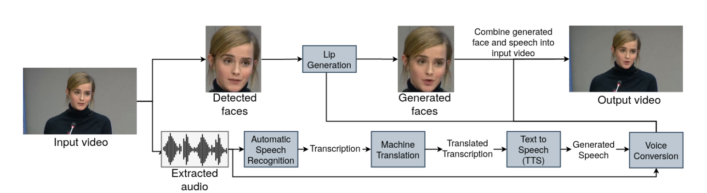

# Deep Speech from the Deep: Language Tech at the Titanic

by Alex Waibel from CMU LTI and Karlsruhe Institute of Technology

### Speech Translation Technology - Milestones

1980s Limited Vocabulary, Limited Syntax --> 2010s Unlimited Vocabulary, Unlimited Syntax

### Face-Dubbing++

The whole system propose a neural end-to-end system for voice preserving, lip-synchronous translation of videos.

The input of this mode is a video and the output of this model is a video as well.

This whole pipeline is made up of two big parts: the video-related part and the voice-related part.

The video-related part is made up of a Automatic Speech Recognition System + Machine Translation System + Text2Speech System + Voice Conversion system.

The voice-related part is made up of Face Detection + Lip Generation + Combine generated face and speech, especially the Lip Generation system is in a GAN architecture.

### Titanic Technologies with Face-Dubbing++

The difficulties using zoom video meeting at the deep sea environment.

1. salt water does not allow for radio communication
2. Communication only by Sonar Signals; Low Bandwidth and only Text Messaging
3. use Face Dubber to build low bandwidth Video Conferencing and use it from the Deep

