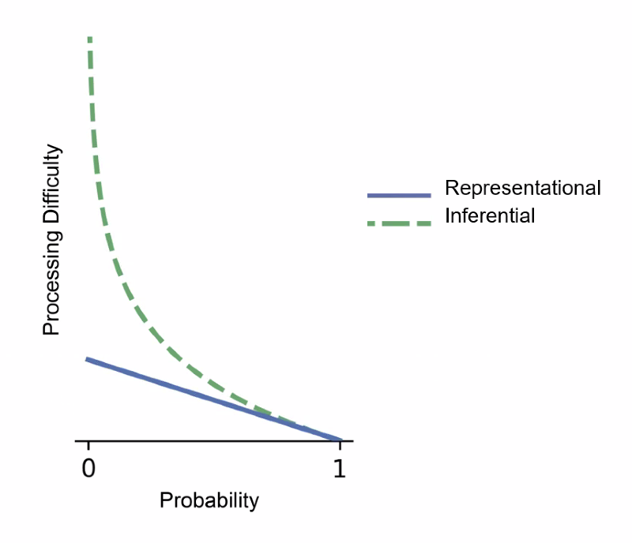
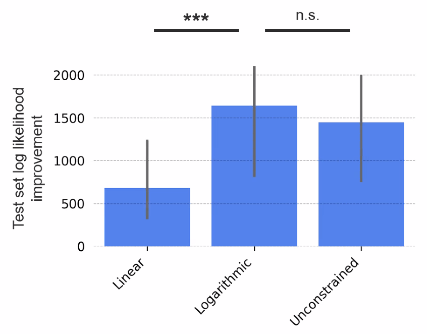
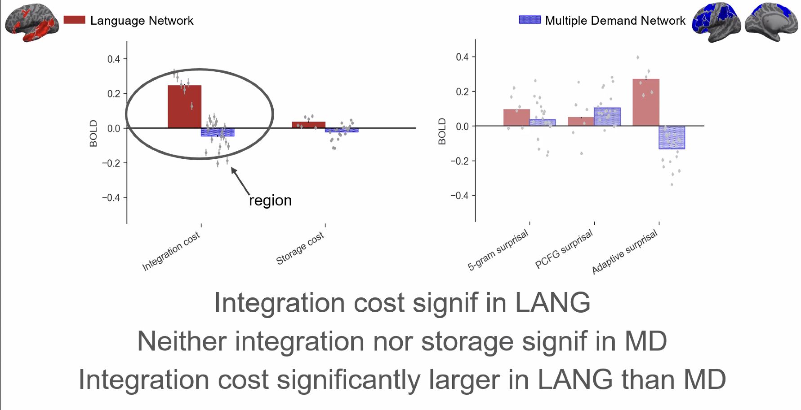

# Uncovering the Algorithmic Foundations of Language Learning and Processing

by Cory Shain from MIT

The previous part of language signal is working memory and the future part of language signal is prediction.

**Key Questions**:

1. What purpose does prediction server? Probablistic Inference.
2. What information affects our predictions? Lexical and structural.
3. Are prediction and memory distinct drivers of processing cost? Both Yes.
4. Are prediction/memory specialized for language? Both Yes.
5. Do prediction/memory pressures shape acquisition? Both Yes.

### What purpose does prediction server?

comprehension = structure building in representational view (Guessing words based on tree-structure with a linear effect)

comprehension = probabilistic inference in inferential view (-logP(word|context) with a log effect)

Method (CDRNNs):

Logarithmic outperforms linear non-logarithmic method.

### What information affects our predictions? 

Does syntax inform our predictions?

Actually, not for certain... Classical expts may be "syntax encouraging"

Do we predict using a domain-specific system?

Actually, maybe not... Sequence prediction is extremely general.

### Are prediction and memory distinct drivers of processing cost?

Does Working Memory drive processing cost at all?

Is Working Memory for language domain-specific?

Based on fMRI results:

### Key Takeaways

Prediction and memory both may guide language acquisition.

Prediction and memory both drive language comprehension.

Prediction and memory resources are specialized for language.

Favors theries that unify the demands of prediction and memory.