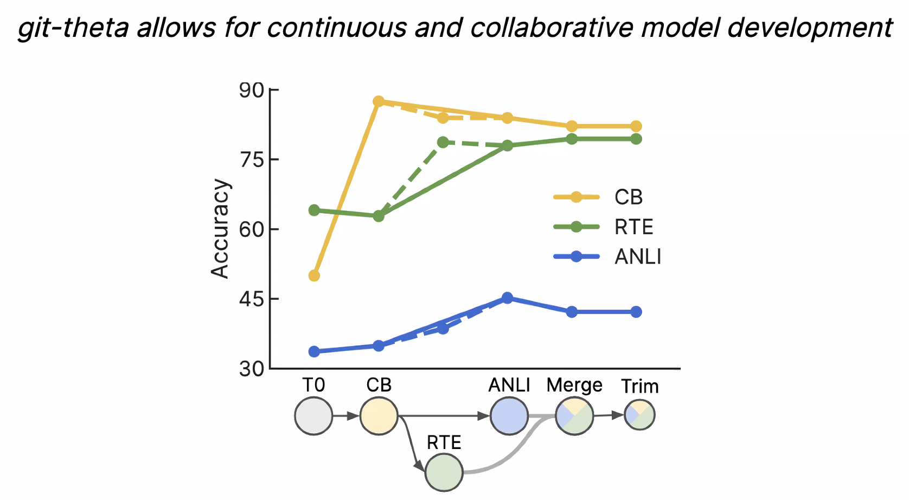

# Collaborative, Communal, & Continual Machine Learning

By Colin Raffel from UNC

Deep learning circa 2013 -- training model from scratch

Deep learning in 2023 -- pre-train then adapt

Scaling Effect:

Duplicate in training data causes memorization:

T5 family:

### Research Topic

How can we enable the collaborative and continual development of ML models?

* Contributors need to be able to make clear the communication patches. (parameter-efficient tuning)
* Maintainers need to be able to merge updates from different models. (Fisher Merging)
* We need to be able to combine modular components for different features. (MoE)
* We need a system for version control for model parameters. (Model-Git)

#### 1. Contributors need to be able to make clear the communication patches.

FISH makes use the Fisher information to choose a parameter subset for updating.

#### 2. Maintainers need to be able to merge updates from different models.

Sequential Training would cause catastrophic forgetting while adding new paths would be beneficial.

Fisher merging can combine the capabilities of different models.

#### 3. We need to be able to combine modular components for different features

Individual experts specialize in different types of data.

#### 4. We need a system for version control for model parameters.

communication-efficient updates result in significant space saving.

### Future Direction

What else do we need to do for the continual development of the machine learning model?

#### 1. Maintainers need to be able to test proposed changes from contributors.

#### 2. Users who lack resources need to be able to train and run these models.

#### 3. We need to track the training data used to train the model.